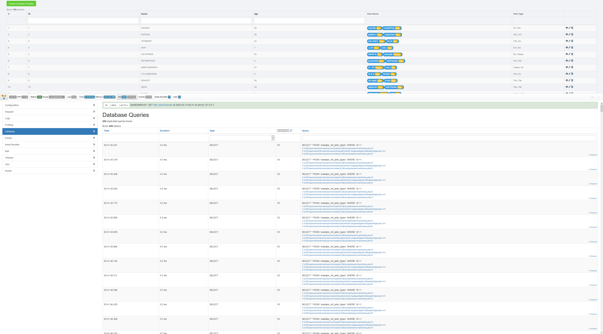
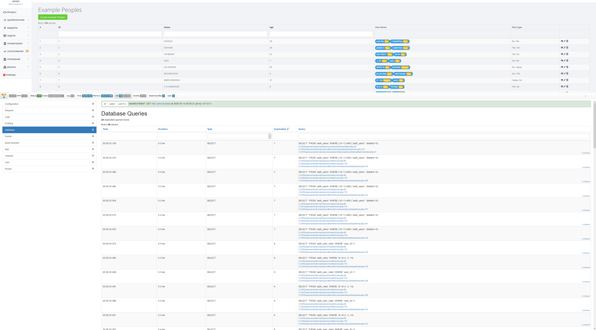

# CQExample
Proof of concept логики кеширования запросов Yii2.

# Идея
Конечная точка любого ActiveQuery-запроса в Yii2 - методы one() и all() (ну ещё count(), но его пока оставим за рамками). Что, если переопределить эти методы так, чтобы всегда использовалось кеширование Yii? Какую выгоду это даст (и даст ли)?

Давайте выясним!

# Установка примера
Вся логика реализована одним модулем, который можно установить в любое Yii2-приложение в четыре шага:
1. Клонируем код модуля:
 
```bash
cd @app/modules && git clone https://github.com/pozitronik/CQExample
```

2. Модуль использует мой [удобненький виджет](https://github.com/pozitronik/yii2-badgewidget) для более крутого и наглядного вывода, установите его через composer:

```bash
php composer.phar require pozitronik/yii2-badgewidget "dev-master"
```

3. Подключите модуль в конфигурации приложения:
```php
		'example' => [
			'class' => 'app\modules\CQExample\CQExampleModule',
			'defaultRoute' => 'main',
			'params' => [
				'enableQueryCache' => false
			]
		],
```

4. Выполните миграцию, которая создаст структуру тестовых таблиц и заполнит их случайными данными:

```bash
yii migrate --migrationPath=@app/modules/CQExample/migrations
```

# Структура кода и экспериментальных данных

Миграция создаст четыре простых таблицы:
* **example_peoples** - типа, люди;
* **example_pets** - типа, животные (которые у этих людей живут);
* **example_ref_pets_types** - типа, типы животных (кошки, собачки, червячки);
*** example_rel_people_pets** - таблица связей между людьми и животными (какой человек какими животными владеет).

Структура связей:
```
	example_peoples.id = example_rel_people_pets.human_id
	example_rel_people_pets.pet_id = example_pets.id
	example_pets.type = example_ref_pets_types.id
```

При выполнении миграции таблицы заполнятся случайными данными (кроме таблицы типов животных), так, чтобы каждый человек владел двумя животными.

ActiveRecord-модели и CRUD вокруг них сгенерированы в Gii, и немного причёсаны. Во всех моделях переопредён метод ::find() для опционального переключения кеширования запросов.

Вывод данных происходит в стандартный GridView + BadgeWidget, который я упоминал выше.
Utils.php используется для генерации случайных данных. ModuleStuff.php - для удобного получения конфига модуля. На эти файлы можно не обращать внимание, для эксперимента они не важны.

Кеширующая обёртка лежит в CachedQuery.php

# Проведение эксперимента

Для эксперимента у приложения должно быть включено кеширование, вполне достаточно просто FileCache.

1. Заходим по url http://your-app-url/example, видим таблицу с сгенерированными данными. В дебаггере (он же у вас включён, верно?) смотрим статистику Database Queries с сортировкой по Duplicated:



Каждый раз, когда Yii нужно получить значение по связанной модели ExampleRefPetsTypes, формируется отдельный запрос к таблице example_ref_pets_types. Каждый раз!

Сами по себе такие запросы не очень затратны, а при включённом кешировании БД их можно было бы и вовсе игнорировать... Но таких запросов может быть очень много, в зависимости от того, какие связанные данные вы получаете. В моём простейшем случае из 449 запросов - 222 повторяющиеся.

2. Теперь включим кеширование в конфиге:

```php
		'example' => [
			'class' => 'app\modules\CQExample\CQExampleModule',
			'defaultRoute' => 'main',
			'params' => [
				'enableQueryCache' => true
			]
		],
```

и повторим запрос (дважды, чтобы кеш прогрелся):



Срань господня, ни одного повторяющегося вызова из этого модуля, время обращения к БД упало до 22ms (против 139), а время исполнения упало на три секунды (больше, чем на треть)!

Очень сильное колдунство!